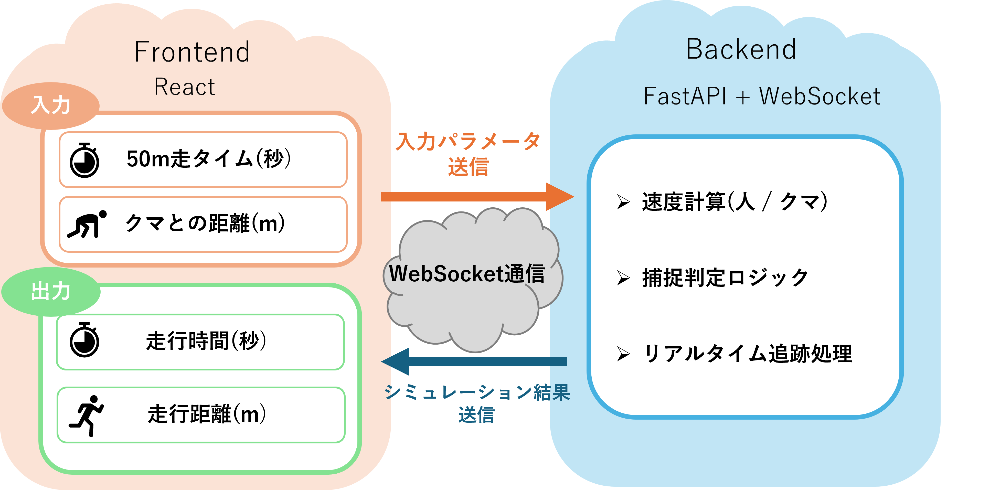

# CompareWithBear
## 人間とクマのシミュレーションWebアプリ

### 概要
CompareWithBearは，人間とクマの走力差をシミュレーションによって可視化し，人間ではいかなる状況においてもクマには走力では勝てないことを実感できる教育・啓発向けのWebアプリです．直感的なUIと数値モデルにより，「もし遭遇したらどうなるか」を安全に体験することができます．
### プロジェクト説明
#### 背景
近年では，クマの出没増加や人身被害が社会問題になっており，「クマ被害」が流行語大賞に選ばれるほど社会的関心が高まっています．一方でクマと相対した場合，人間の誤解や過信が危険な判断につながるケースも少なくありません．本プロジェクトは，単純なモデルに従い，人間とクマの走力の差を可視化し，状況に応じた適切な行動理解を促すこと目的としています．
#### 製品説明
ユーザーは自分自身の50m走のタイム(秒)とクマとの相対距離(m)を設定し，シミュレーションをリアルタイムで実行します．クマに追い付かれるとシミュレーションは終了し，追い付かれるまでの時間と走行距離が表示されます．

#### 特徴
#### ローカルにおける実行方法
### 今後の展望
## 開発技術・環境
- **フロントエンド**
react
- **バックエンド**
docker
python
uv
uvicorn
fastapi
## チーム情報
- **チーム名** ： そなめ